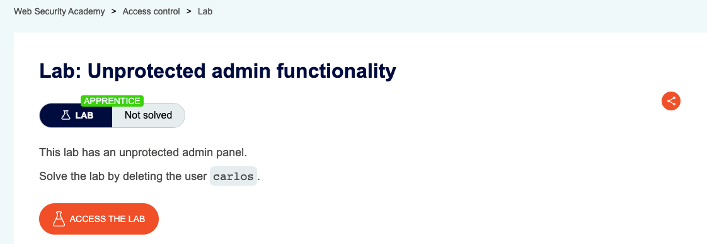
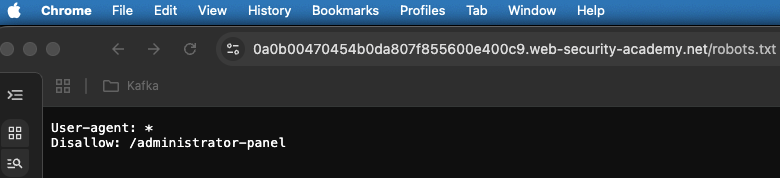
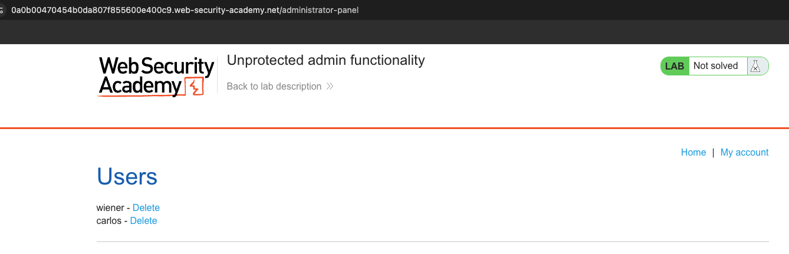
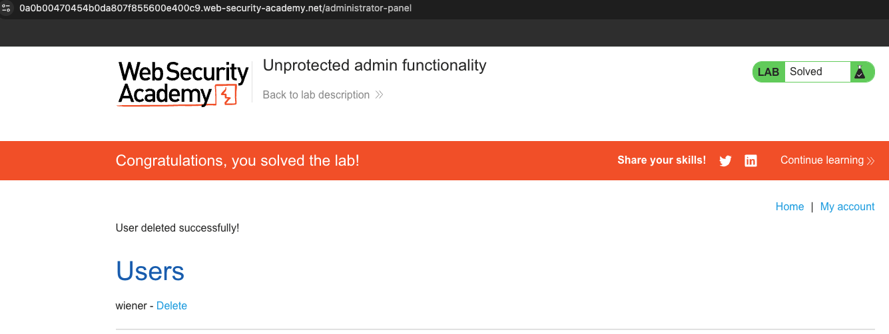

## Lab Description :

## Solution :
For that we can look for one of the common web directories like the **robots.txt** and **sitemap.xml**
 
#### robots.txt

We see a **disallowed login** entry here for the admin panel which is `/administrator-panel`.

On visiting the `/administrator-panel` directory, we get the admin panel.

So we click the link to delete the user *carlos* to solve the lab. 

## Result

