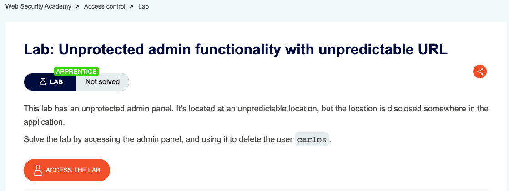
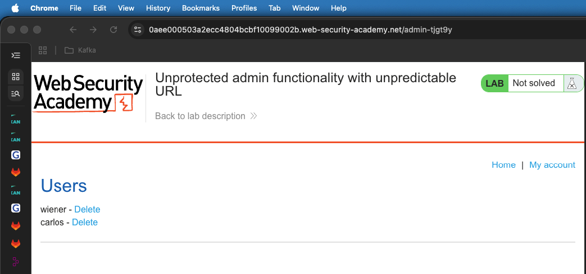
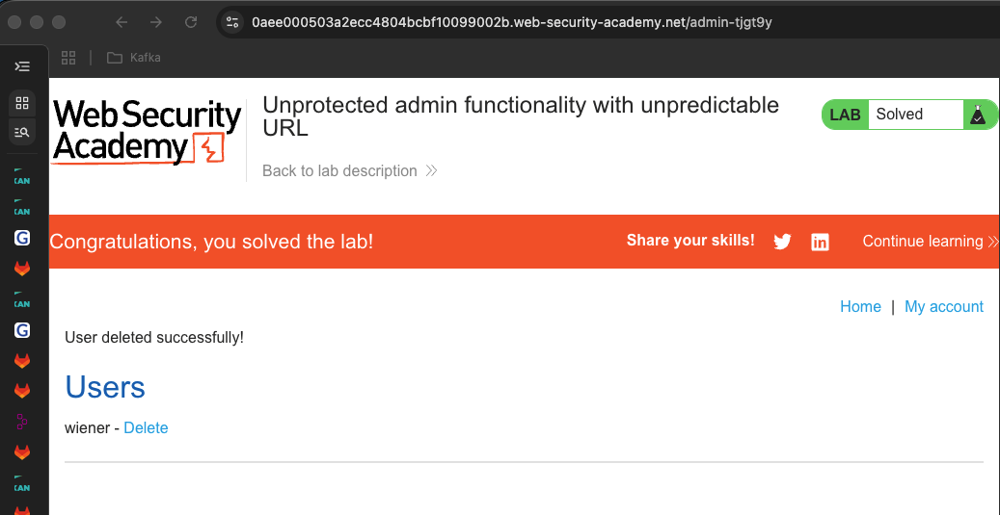

## Lab Description :




## Solution :

On seeing the source code, we see a javascript code which checks if the user is **admin**, then it redirects us to `/admin-tjgt9y` endpoint which is the admin panel.

```javascript
if (isAdmin) {
   var topLinksTag = document.getElementsByClassName("top-links")[0];
   var adminPanelTag = document.createElement('a');
   adminPanelTag.setAttribute('href', '/admin-tjgt9y');
   adminPanelTag.innerText = 'Admin panel';
   topLinksTag.append(adminPanelTag);
   var pTag = document.createElement('p');
   pTag.innerText = '|';
   topLinksTag.appendChild(pTag);
}
```

So we could directly browse to that directory to view the admin panel.



Click on ther  *DELETE* link of carlos to delete the carlos user .Thus lab is solved.


## Result

