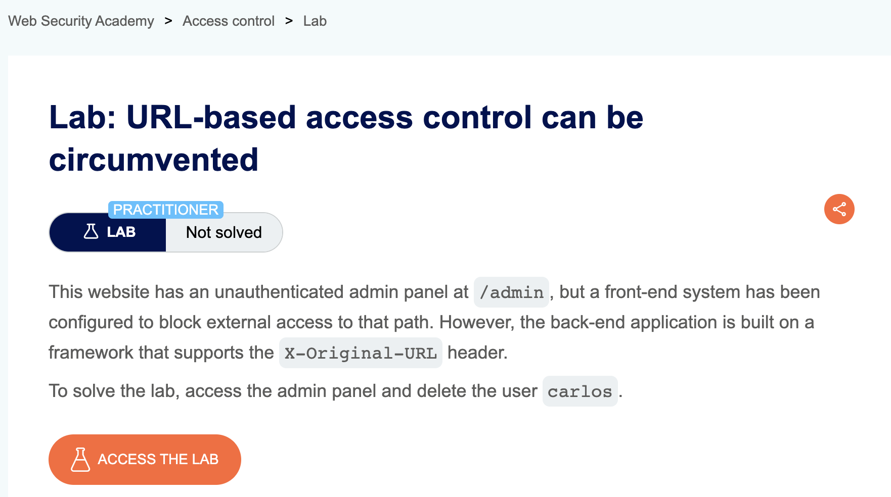
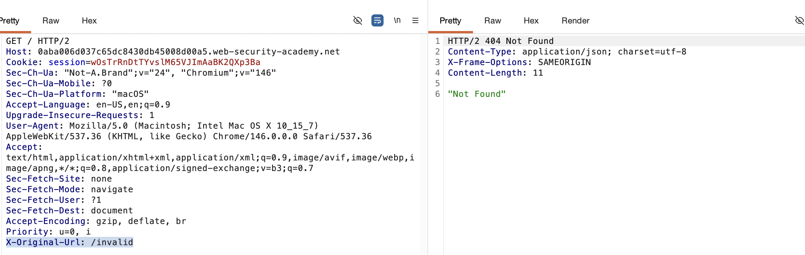
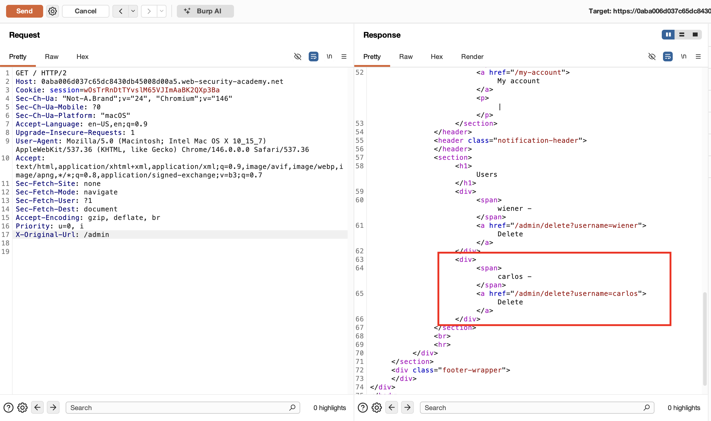
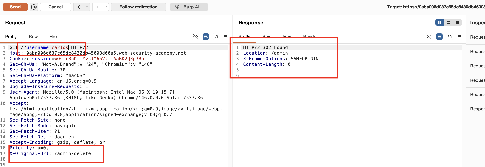
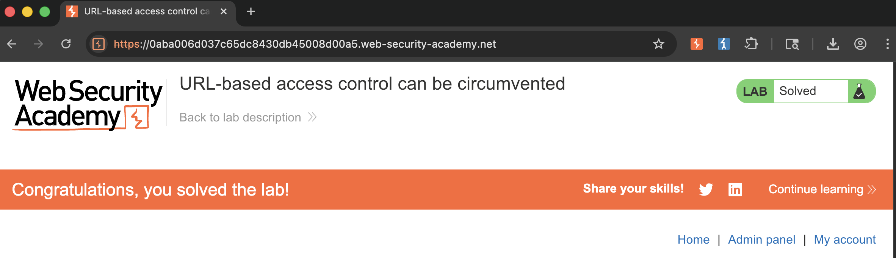

## Lab description

## Solution
Thử truy cập vào path `/admin`, bị **"Access denied"**

Request truy cập `/` đẩy vào Repeater, bổ sung thêm header `X-Original-Url: /invalid` thì response trả về `Not Found`

Có thể là Backend sẽ xử lý URL thông qua header này
Thay giá trị `/admin` vào header trên, ta sẽ truy cập được vào admin panel

Path để delete user `carlos` là `/admin/delete?username=carlos`
Ta thay `X-Original-Url: /admin/delete` và để parameter trên url

Như vậy là account `carlos` đã bị xóa

## Result
