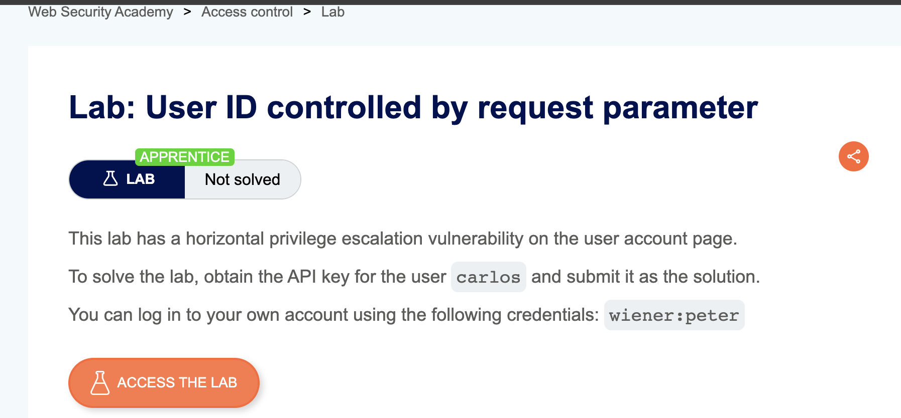
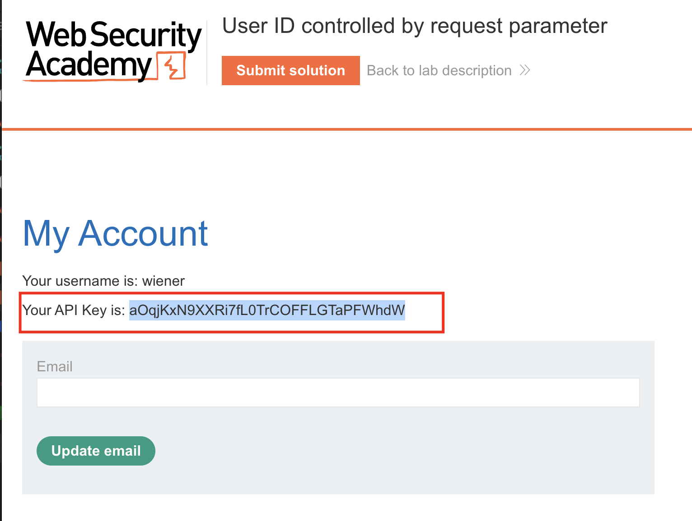
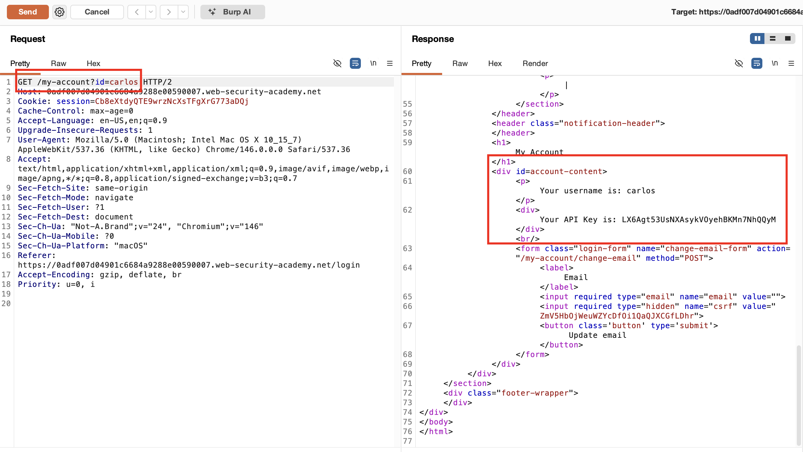
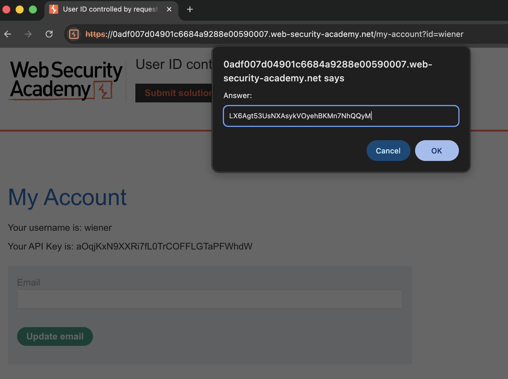
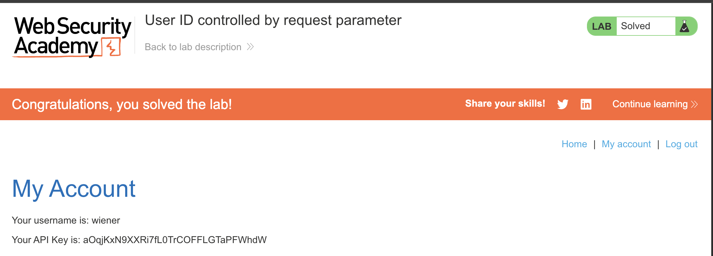

## Lab Description :

## Solution :

Login với username/pass được cung cấp.

Khi login xong, chúng ta sẽ nhìn thấy API key of `wiener` - `aOqjKxN9XXRi7fL0TrCOFFLGTaPFWhdW`

Request `/my-account` đang có parameter `?id=wiener`.

Đổi giá trị thành `carlos` , ta sẽ lấy được API key của `carlos` là `LX6Agt53UsNXAsykVOyehBKMn7NhQQyM`

Submit giá trị này là hoàn thành bài

## Result

 
