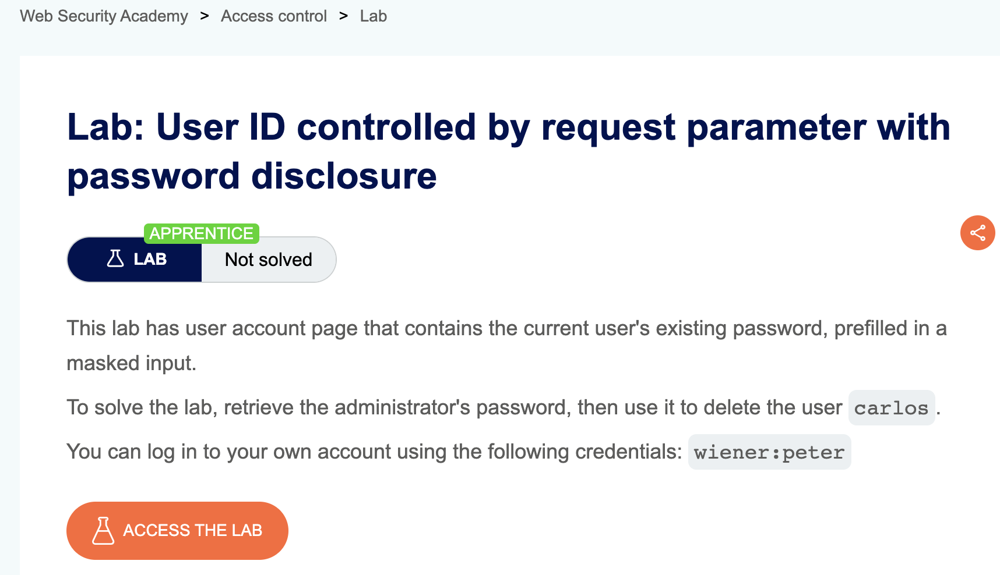
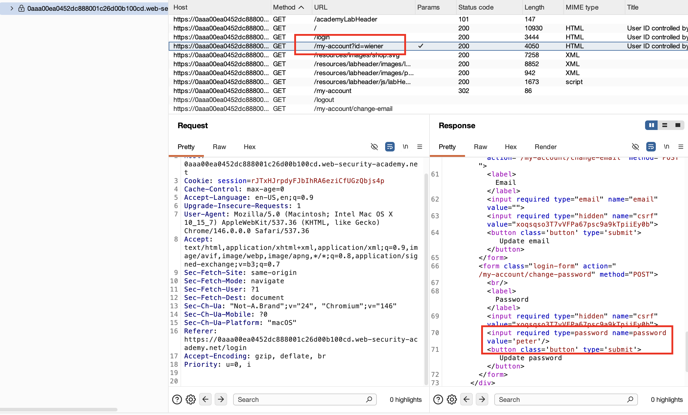
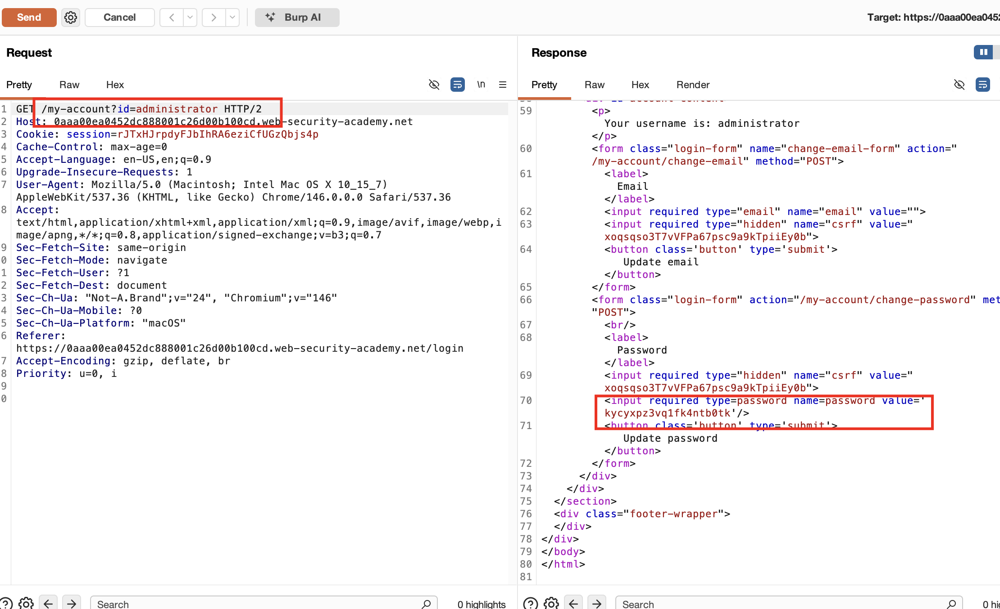
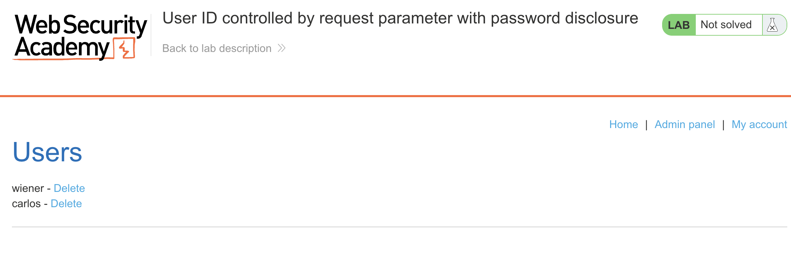
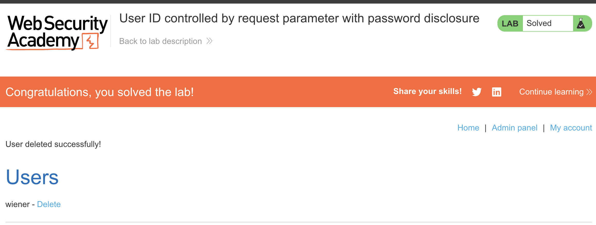

## Lab Description :

## Solution :

Login với tài khoản được cung cấp. Sau khi login, ta thấy request `/my-account` với parameter `?id=wiener` trả về có bao gồm password trong form update

Thay paramerter thành `administrator`, ta sẽ lấy được password của admin.

Sử dụng password lấy được để login bằng tài khoản administrator, vào phần admin panel và xóa user `carlos`.

## Result

