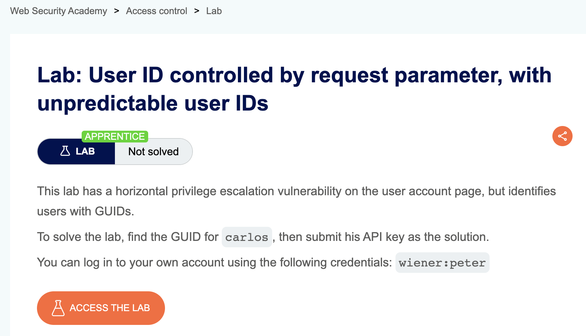
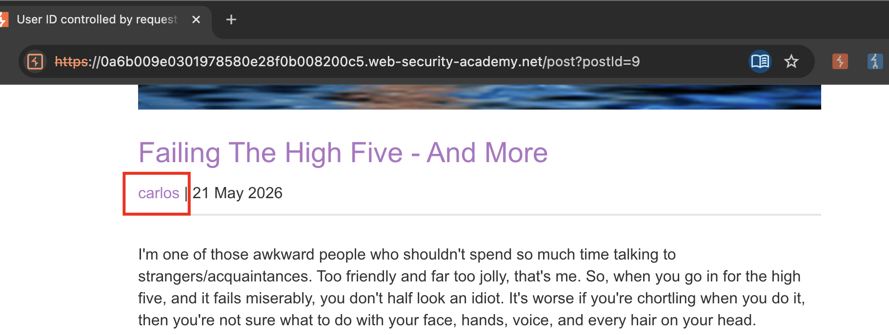
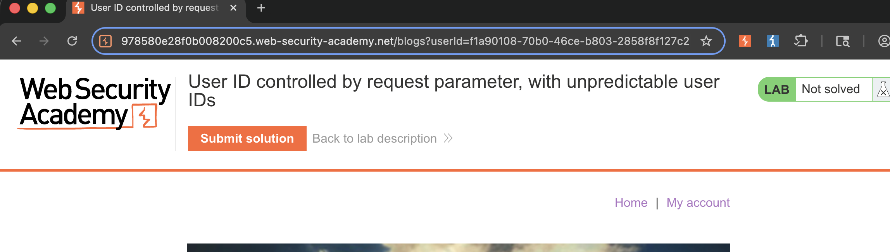
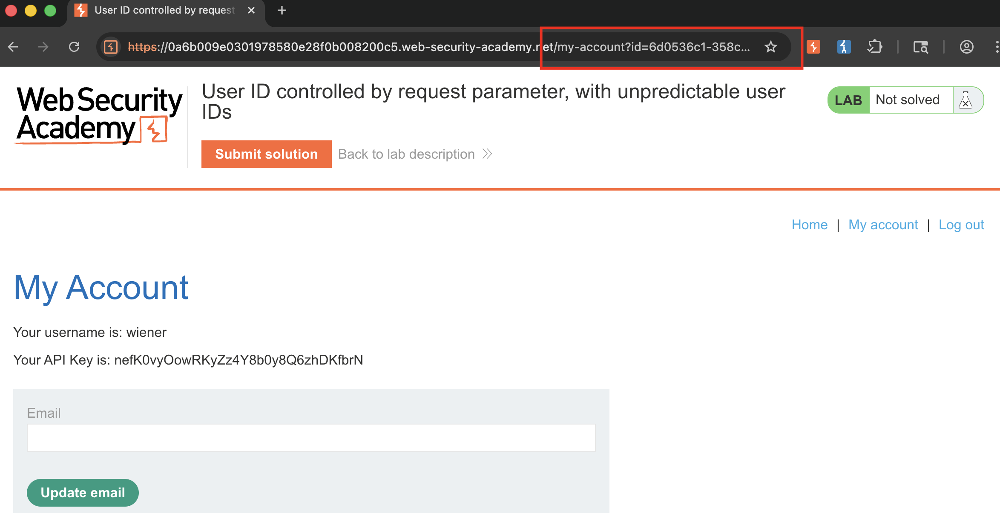
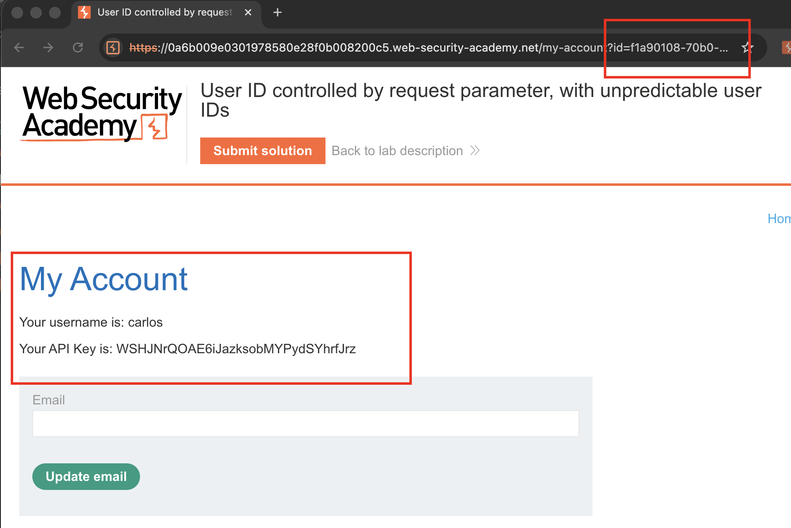
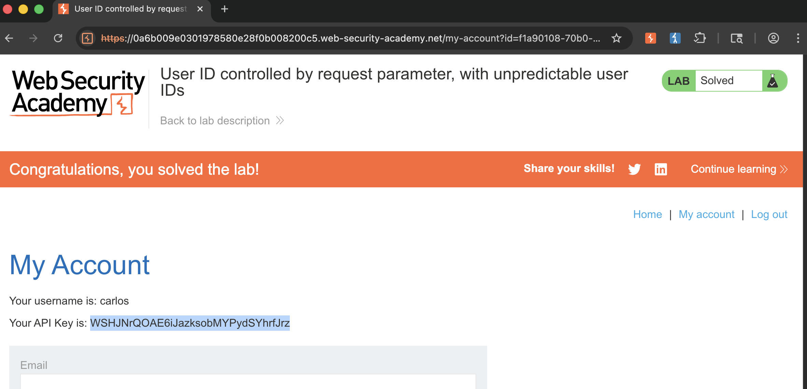

## Lab Description :

## Solution :

Tìm 1 bài post của `carlos`. Ví dụ như ảnh

Click vào `carlos`, page sẽ redirect về list blog, nhưng giờ sẽ kèm theo user_id trong param filter

-> carlos có `user_id = f1a90108-70b0-46ce-b803-2858f8f127c2`

Giờ ta quay lại vào phần login, đăng nhập với tài khoản được cung cấp, url của page sẽ bao gồm user_id của tài khoản `wiener`

Thay thế user_id của `carlos` vào url, ta sẽ lấy được API-key.

Điền API key vào `Submit Solution` là hoàn thành lab.

## Result

