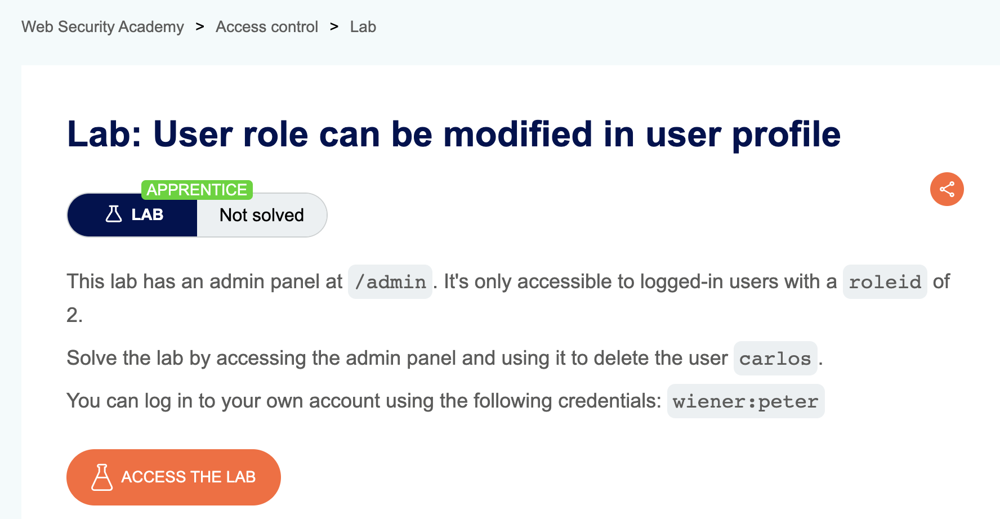
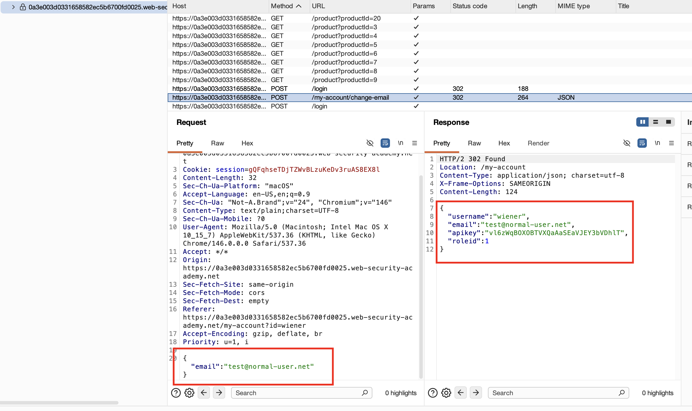
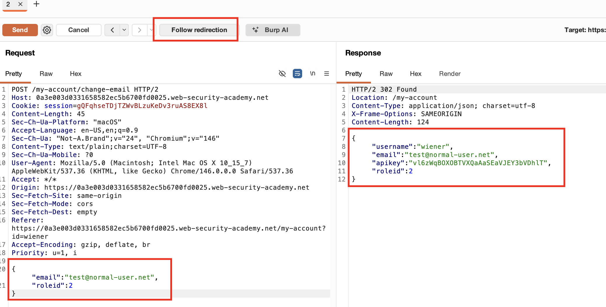
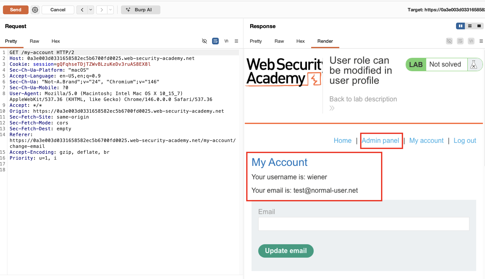
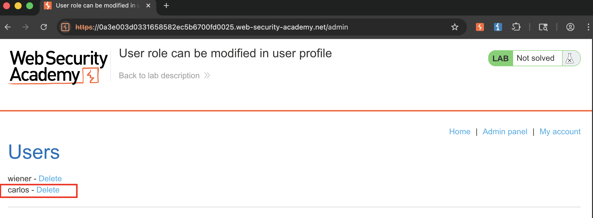
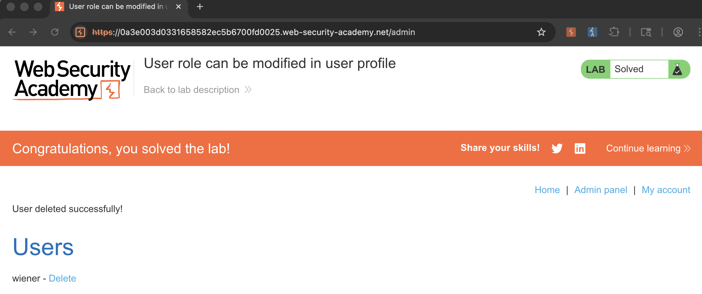

## Lab Description :

## Solution :

Như mô tả của lab, chúng ta có thể nhìn thấy admin panel chỉ khi role của ta `roleid=2`
Login với username/pass được cung cấp.
Kiểm tra request login, không có bất kỳ cookie nào đặc biệt để khai thác lỗ hổng.

Ta thử update email và kiểm tra request

Nhận thấy, có giá trị `roleid=1` trong JSON response.
Vậy ta thử thêm value `roleid=2` trong JSON request

Ta nhận về response 302 Redirect, roleid trả về trong response cũng chuyển thành 2.

Click vào `Follow redirect`,

Giờ ta có thể thấy admin panel ở trình duyệt
Vào admin panel và xóa user `carlos` là hoàn thành bài

## Result

