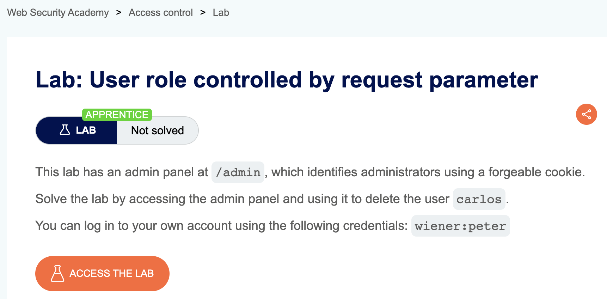
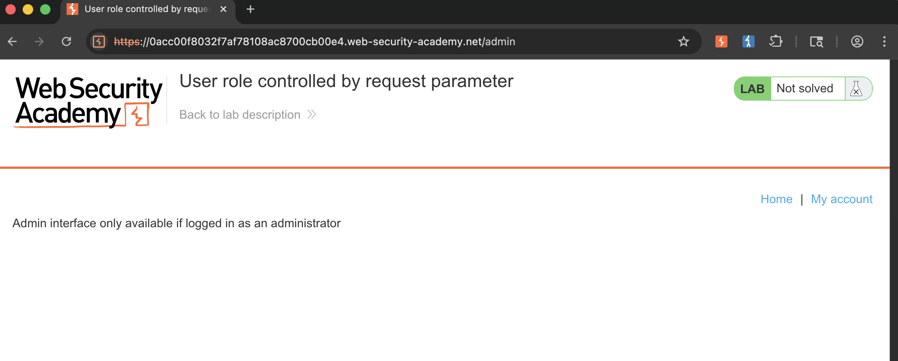
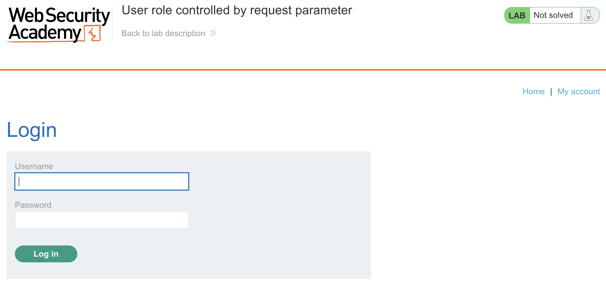
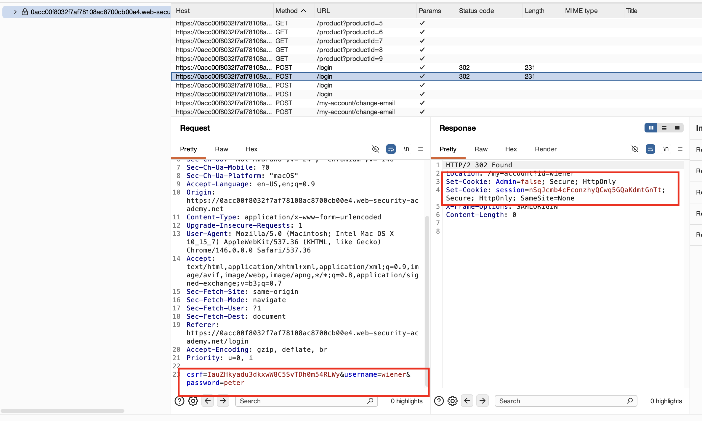
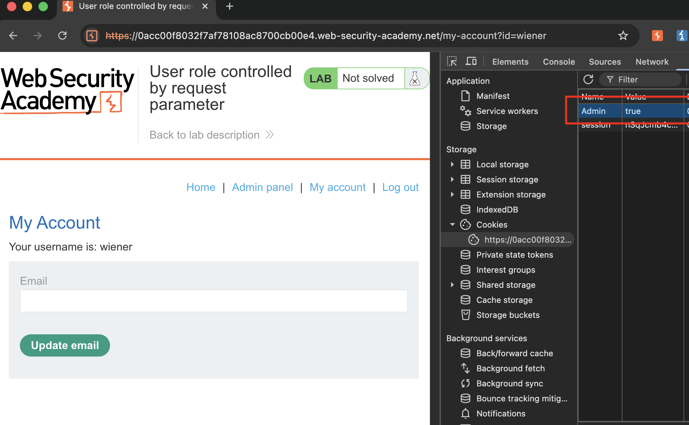
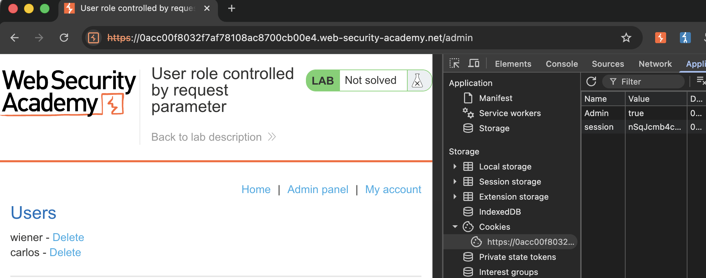
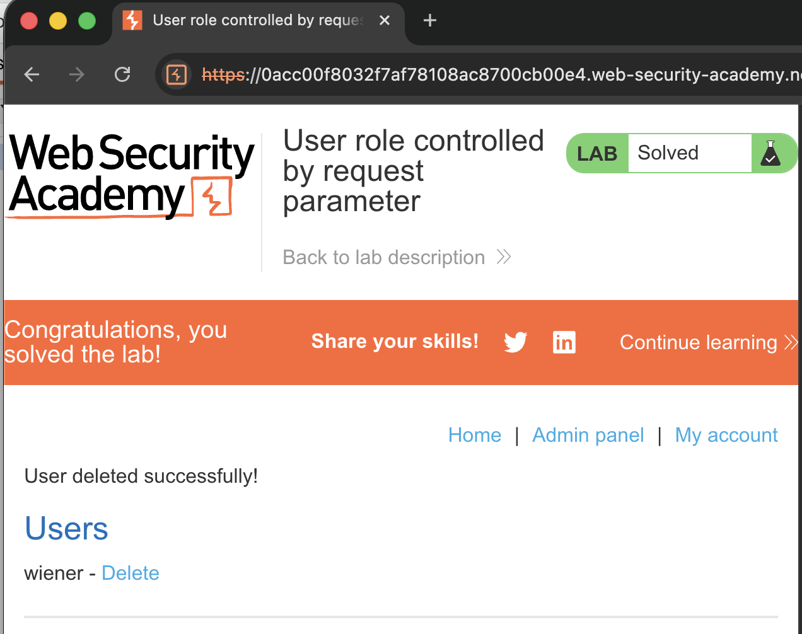

## Lab Description :

## Solution :

Access to admin page via path `/admin`

Clicking on `My account` takes us to a login page.

We enter the credentials which is given in the lab description - `wiener:peter`

When we login we get to see

Response đã set 2 Cookie là session để lưu phiên đăng nhập và 1 cookie là Admin=false để đánh dấu `wiener` không phải admin. 

Vào Application trên dev-tool, sửa cookie `Admin=true`, page sẽ hiện ra Admin Panel

Truy cập vào Admin Panel và xóa user `carlos` là đã hoàn thành bài

## Result

