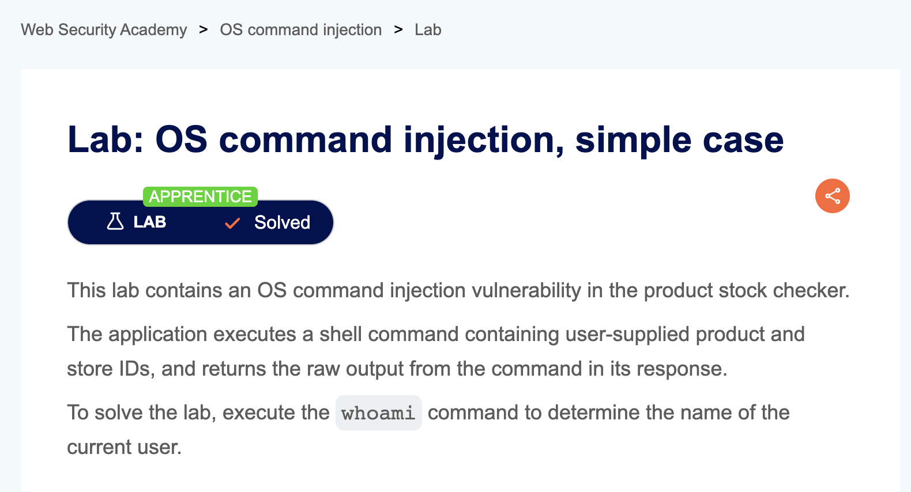
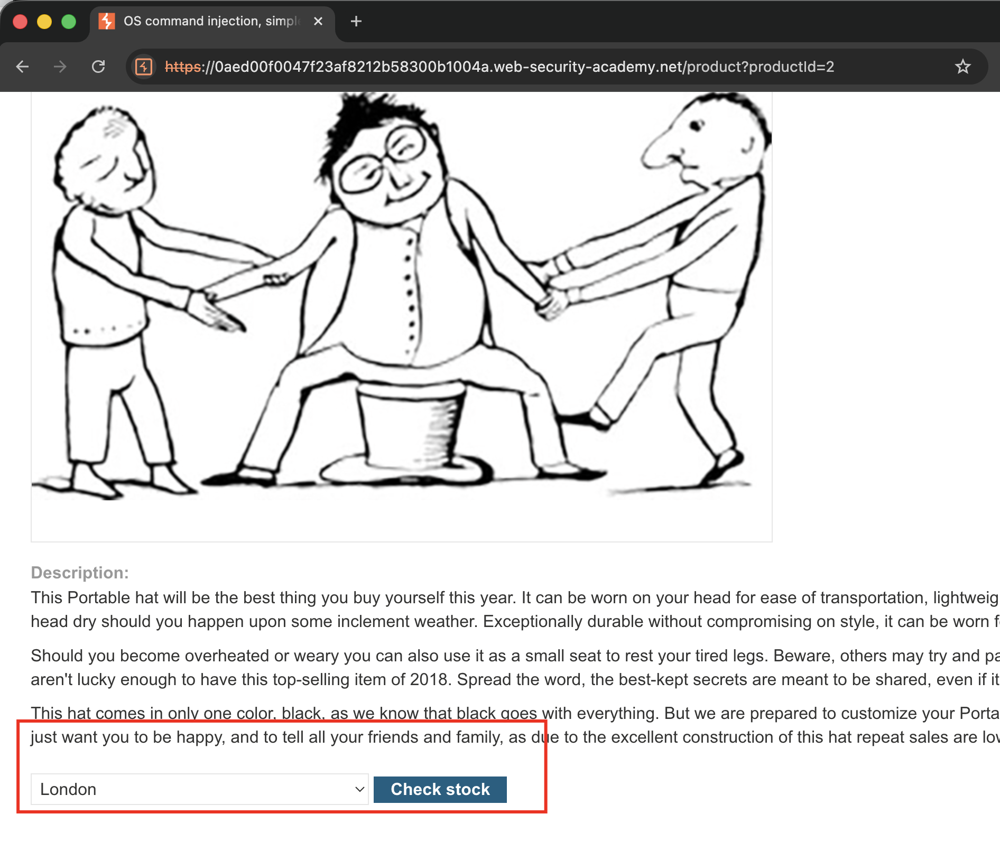
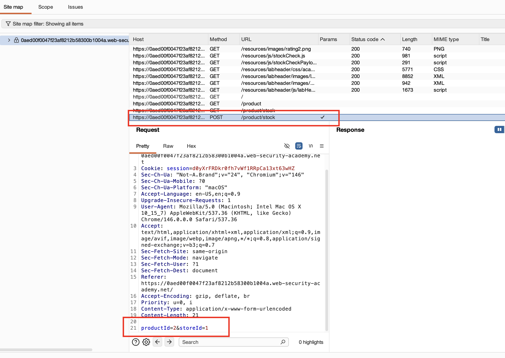
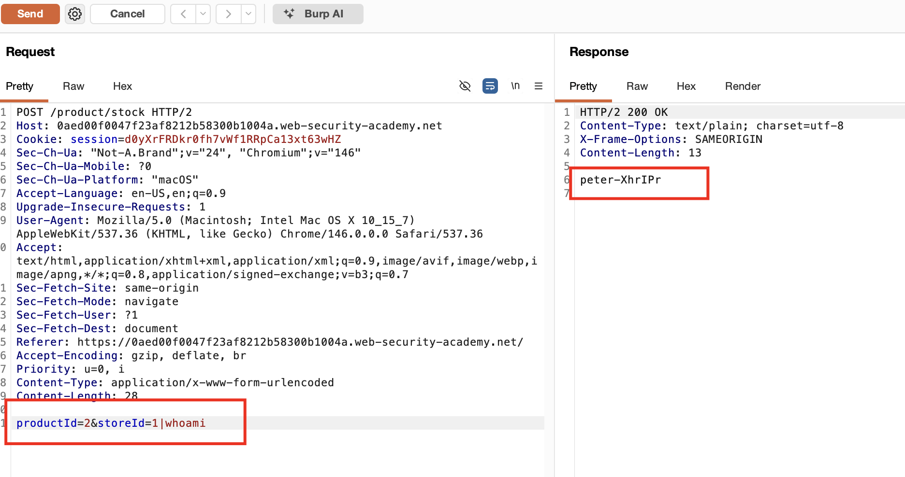

## Mô tả Lab

### Giải pháp
Khi vào chi tiết sản phẩm, lỗ hổng nằm ở bộ lọc check stock

Khi click vào link check stock, request & response trông như sau

Chúng ta cần kiểm tra tham số nào bị lỗ hổng, theo hướng dẫn là `storeID`

> storeID

Request & Response

