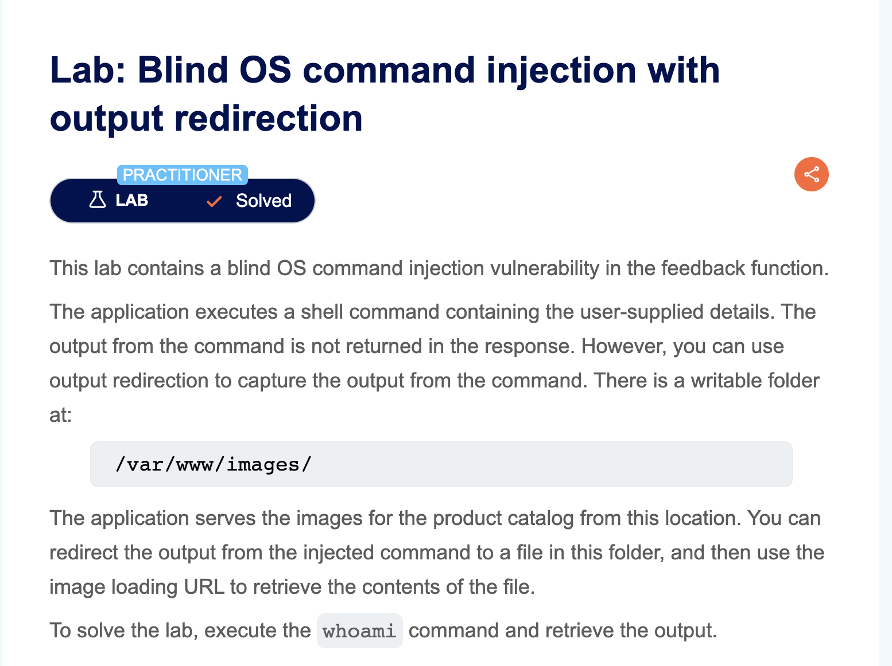
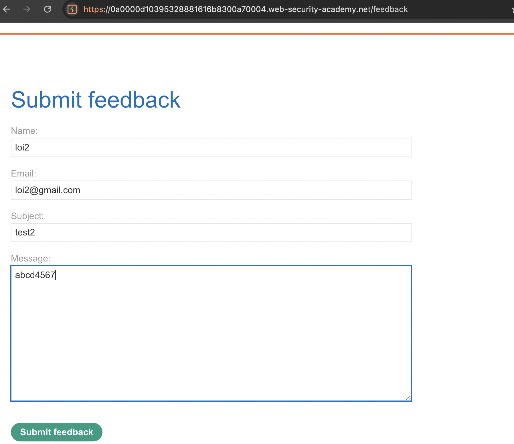
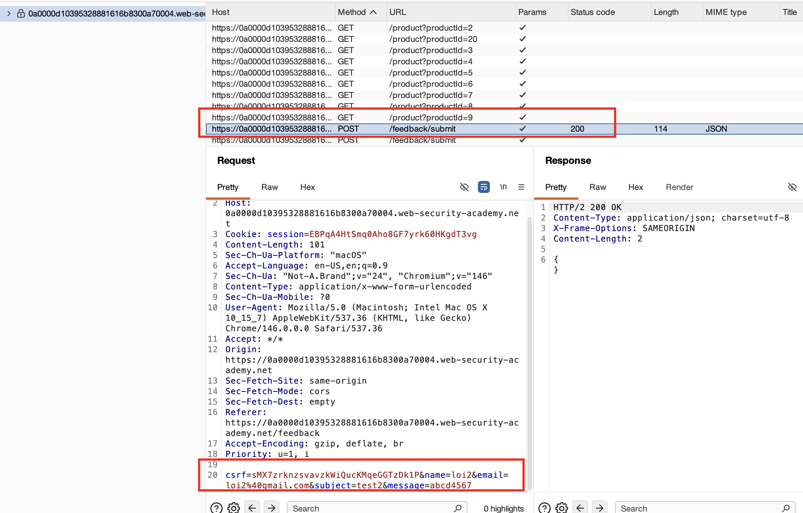
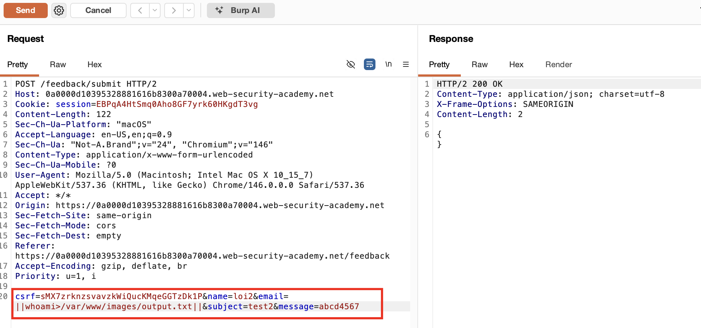
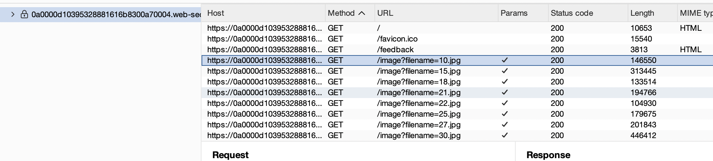
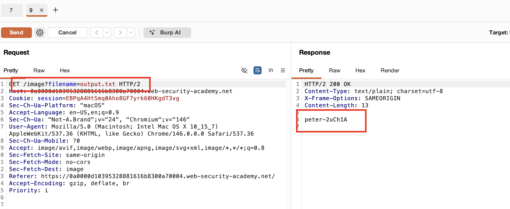

## Mô tả Lab

### Giải pháp

Tương tự bài with_time_delays, ta lại vào form feedback và điền các thông tin vào form, submit form.

Khi submit form feedback, request trông như sau

Như đã biết, tham số `email` bị lỗ hổng, chúng ta truyền payload `email=||whoami>/var/www/images/output.txt||`

Sau khi lưu kết quả lệnh `whoami` vào `/var/www/images/output.txt`, chúng ta có thể kiểm tra nội dung.

Để tìm tham số filename, chúng ta kiểm tra tab `HTTP history`, ở đó có thể thấy request GET được thực hiện để lấy tất cả file ảnh ở trang chủ

Chuyển request sang tab Repeater. Chúng ta sửa `filename = output.txt` và trong response nhận được tên người dùng!

