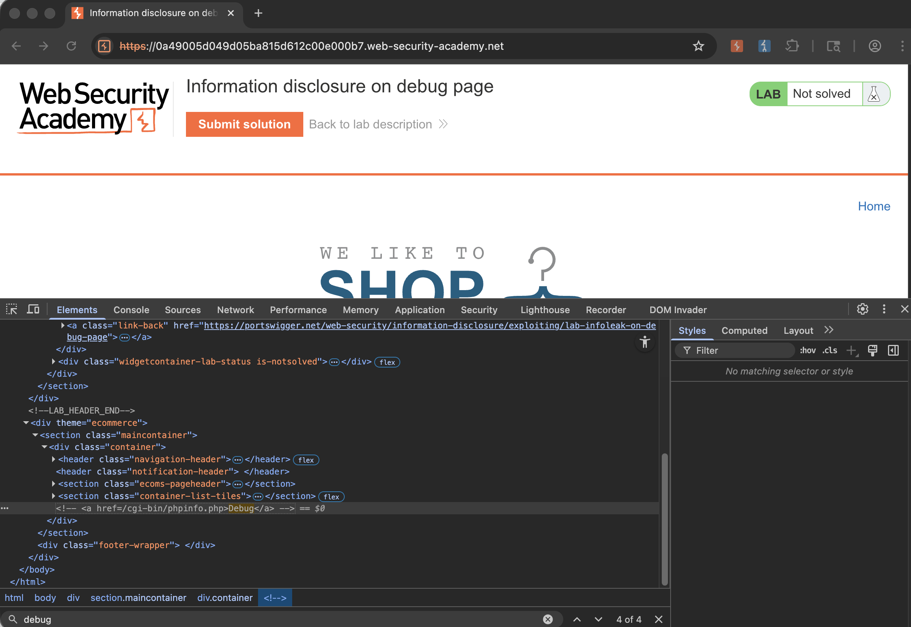
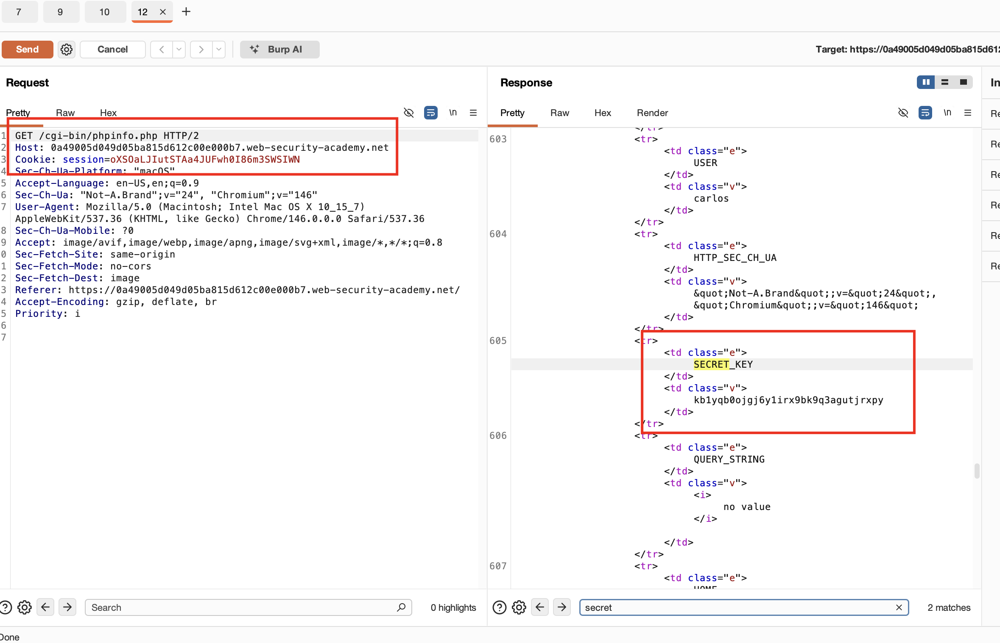
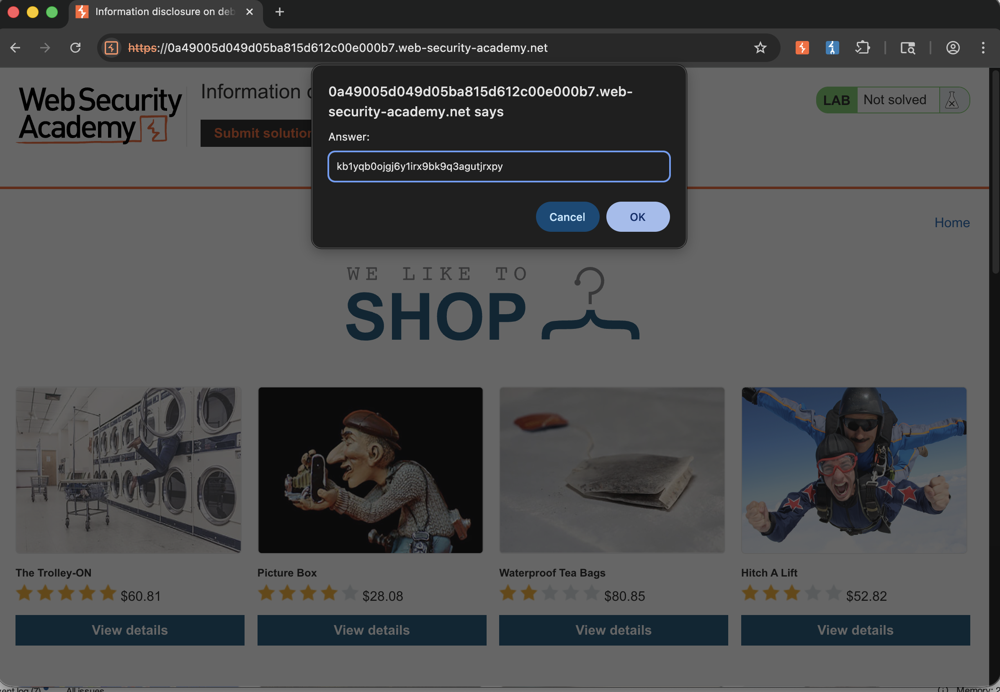

## Lab Description :


## Solution :
Do không có bản Pro để làm như hướng dẫn, nên mò theo comment trong Elements của Dev tool, thấy có dòng như sau
```
<!-- <a href=/cgi-bin/phpinfo.php>Debug</a> -->
```


From that , we can see that there is a href pointing to **/cgi-bin/phpinfo.php**.

Send the request to repeater(add the path /cgi-bin/phpinfo.php)


n the response we can see that lot of information is revealed including the value of `SECRET_KEY` - `kb1yqb0ojgj6y1irx9bk9q3agutjrxpy`

```html
<tr>
  <td class="e">SECRET_KEY </td>
  <td class="v">kb1yqb0ojgj6y1irx9bk9q3agutjrxpy </td>
</tr>
```

Submit secret and done the lab


## Result
