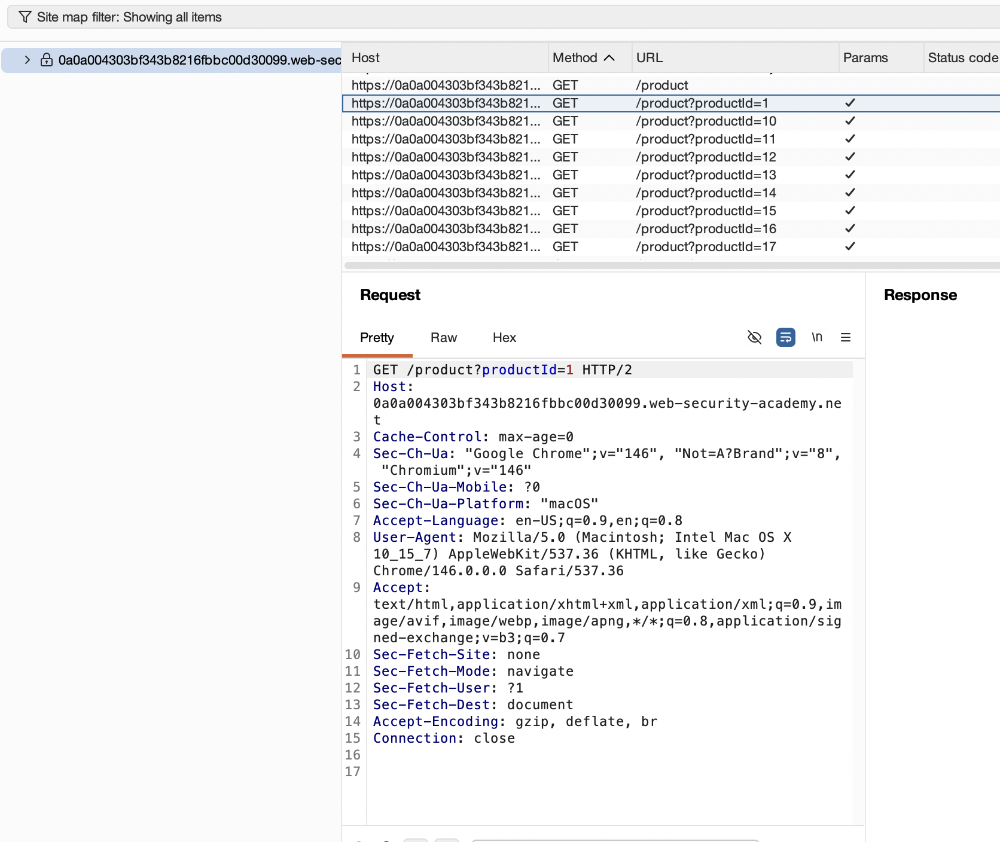
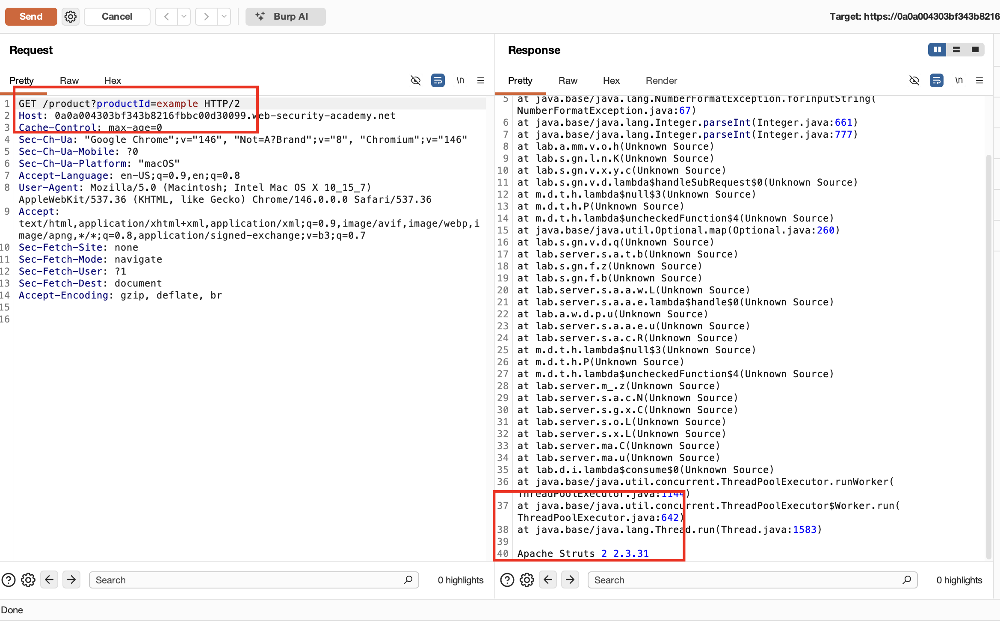
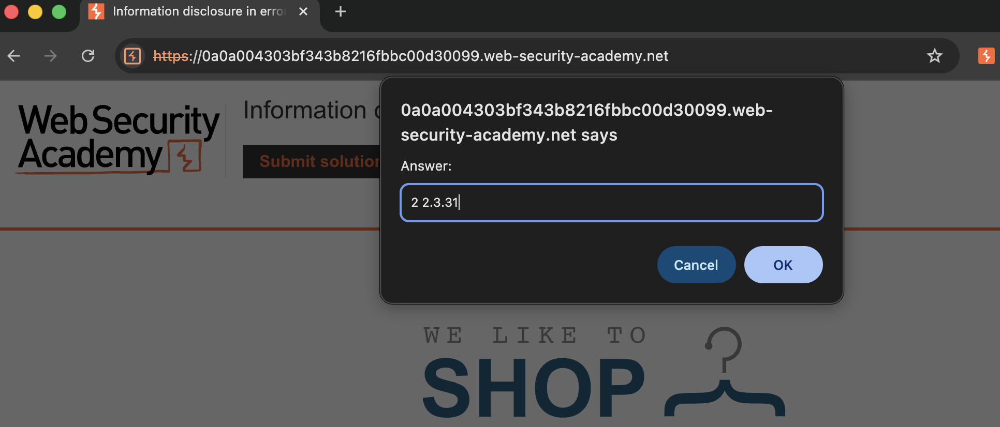

## Lab Description :


## Solution :
GET request for product pages contains a productID parameter and send to Repeater




Change the value of the productId parameter to a non-integer data type, such as a string. Send the request:

```
GET /product?productId="example"
```

Response:


At the end of the response, we have the name & version of the software that is being used in the backend - `Apache Struts 2 2.3.31`

Go back to web and submit solution: 

## Result
