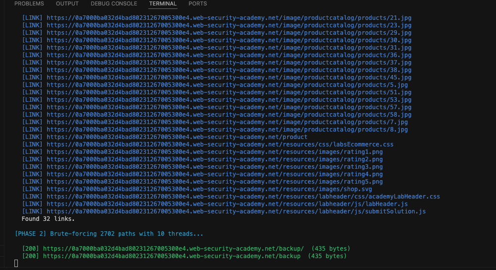
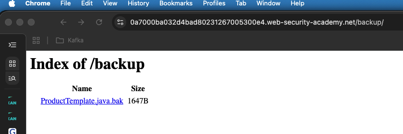
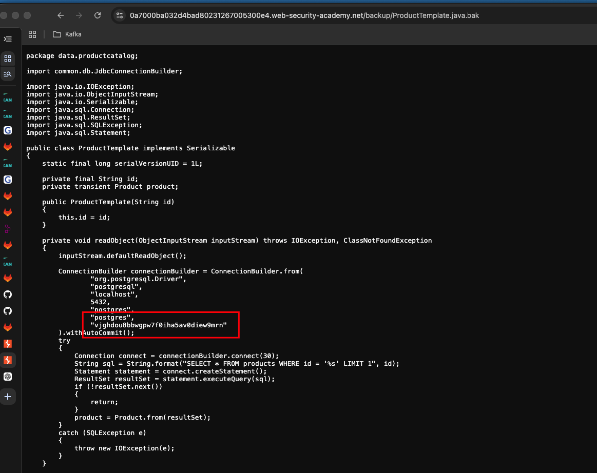
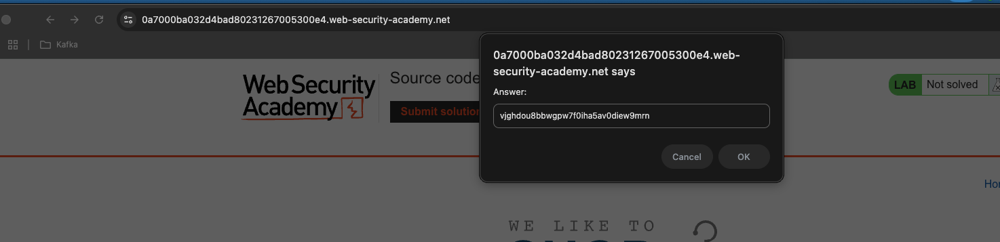
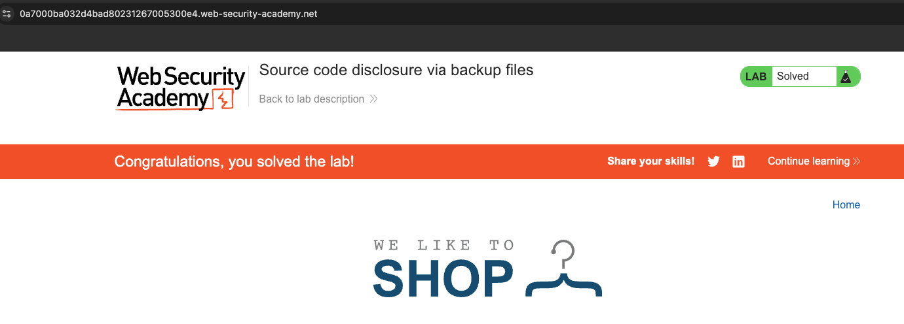

## Lab Description :

## Solution :

Viết 1 tool bằng python để crawl các link và brute-force 1 vài path dựa trên worklist

The scan results reveal that there is a `/backup` directory.

#### /backup directory

Here we have a file named **ProductTemplate.java.bak**. Let's download the file & view its contents to retreive the **database password**

The above code uses **ConnectionBuilder class** to establish a connection to a *PostgreSQL* database. There we can see a random string [`vjghdou8bbwgpw7f0iha5av0diew9mrn`] which might be the database password that is used to establish the connection.

Submit the db_password to solve the lab.

## Result
