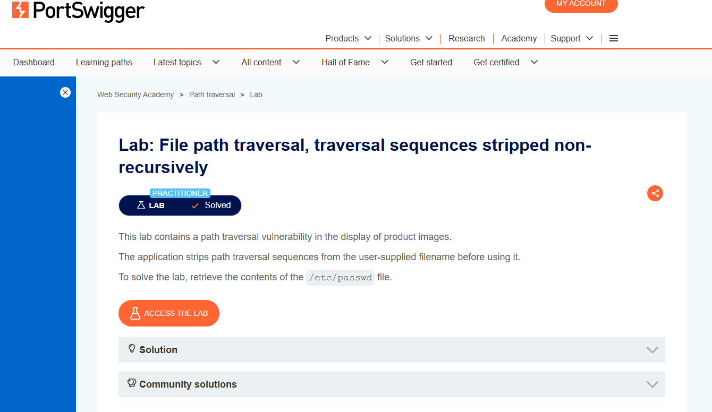
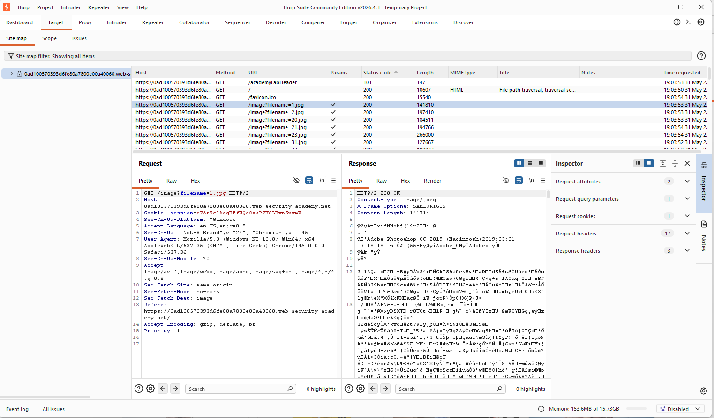
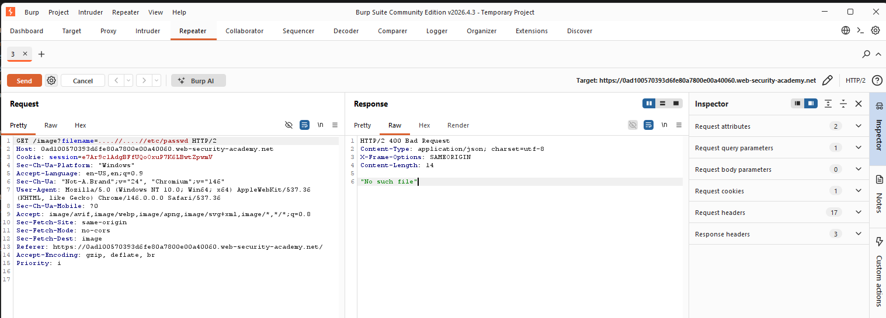
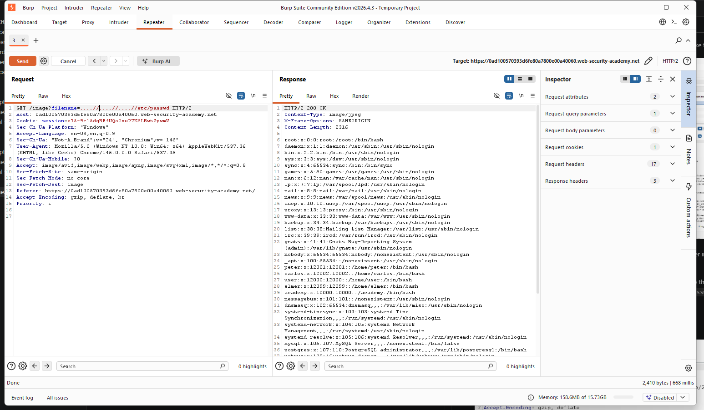
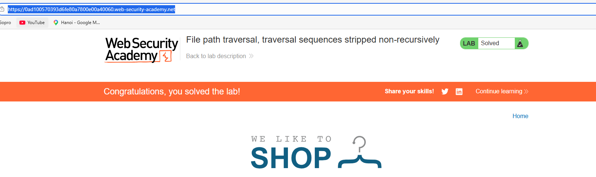

## Mô tả Lab :

## Giải pháp :

Khi trang web tải, tất cả ảnh được tải. Request được bắt trông như sau,

Khi truyền `../etc/passwd`, ứng dụng web loại bỏ `../` khiến input của người dùng được hiểu là **etc/passwd**.

Để bypass điều này, chúng ta cần dùng *các chuỗi traversal lồng nhau* như *....//etc/passwd*, để dù server có loại bỏ *../* thì chuỗi truy vấn kết quả được xử lý bởi server vẫn là `../etc/passwd`.

Đầu tiên chúng ta thử payload - `....//....//etc/passwd`

Chúng ta nhận được response chứa **400 Bad Request**.

Tiếp theo khi thử payload - `....//....//....//etc/passwd`, chúng ta nhận được nội dung của file.

## Kết quả

