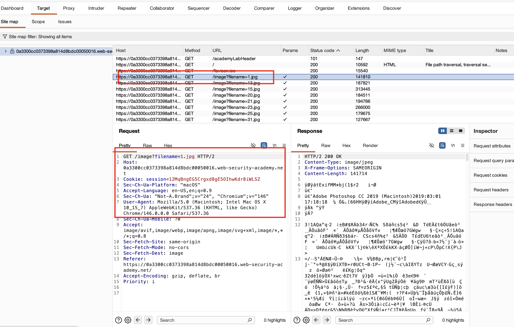
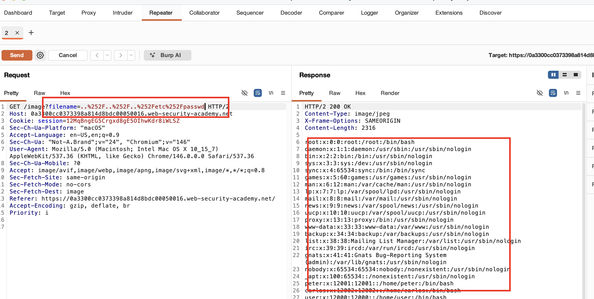

## Mô tả Lab :
File path traversal, các chuỗi traversal bị loại bỏ với URL-decode dư thừa

## Giải pháp :

Request tải ảnh trông như sau,

Trong lab này, server loại bỏ tất cả các chuỗi directory traversal **../** và cả **..%2F..%2F..%2F** (mã hóa kép), vì vậy để bypass chúng ta có thể dùng **mã hóa ba lần**.

Vì vậy để bypass, chúng ta dùng phiên bản mã hóa ba lần của **../../../etc/passwd** là `..%252F..%252F..%252Fetc%252Fpasswd` làm payload.

Lúc này chúng ta nhận được response chứa nội dung của file.

