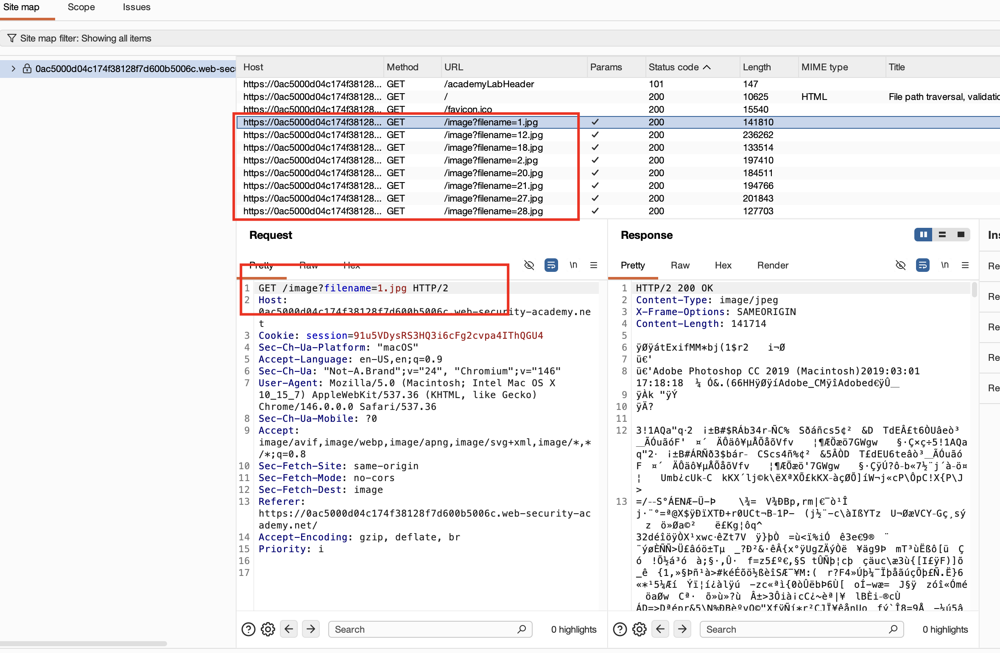
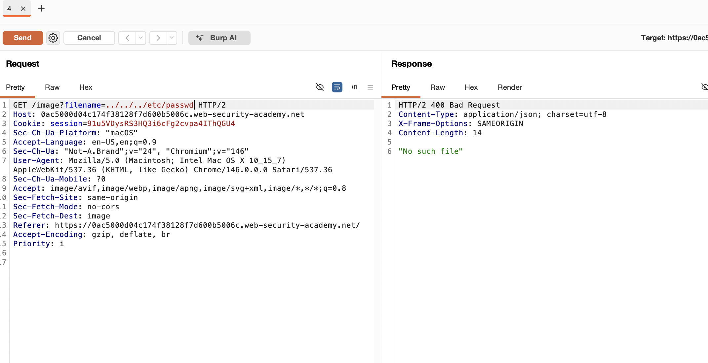
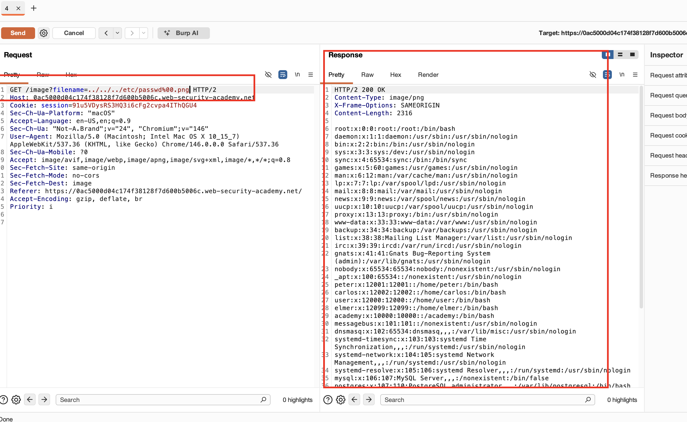

## Mô tả Lab :


## Giải pháp :

Nếu ứng dụng yêu cầu tên file do người dùng cung cấp phải kết thúc bằng phần mở rộng file cụ thể, chẳng hạn .png, thì có thể dùng **null byte** để kết thúc đường dẫn file trước phần mở rộng bắt buộc.

Ví dụ:

```bash
filename=../../../etc/passwd%00.png
```
> LƯU Ý - `%00` là một null byte được dùng để kết thúc chuỗi trong một số ngôn ngữ lập trình và có thể được dùng trong URL input để đánh lừa ứng dụng xử lý input như một loại file khác

Request được bắt khi tải ảnh của website trông như sau,



Ở đây, giống như tất cả các lab trước, nó tải một ảnh *.jpg*.

Nếu truyền payload thông thường như `../../../etc/passwd`, chúng ta sẽ nhận được **400 Bad Request**.



Điều này là vì có một biện pháp bảo mật đang được áp dụng. Server chỉ chấp nhận các input kết thúc bằng phần mở rộng .jpg.

Vì vậy chúng ta tạo payload sao cho thỏa mãn điều kiện của server và đồng thời lấy được **/etc/passwd**.

Vậy payload cuối cùng sẽ là `../../../etc/passwd%00.png`


