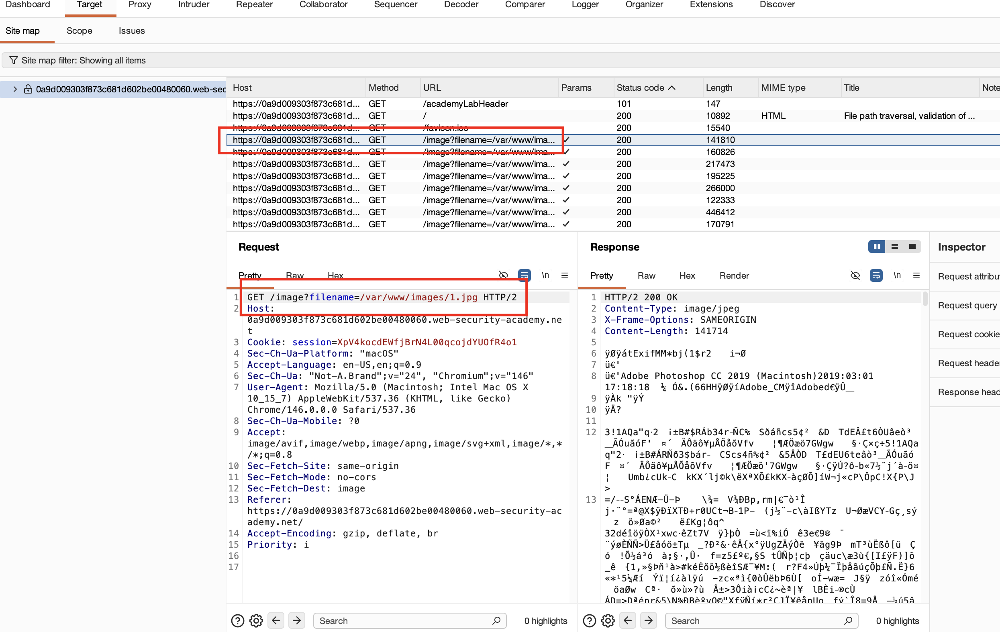
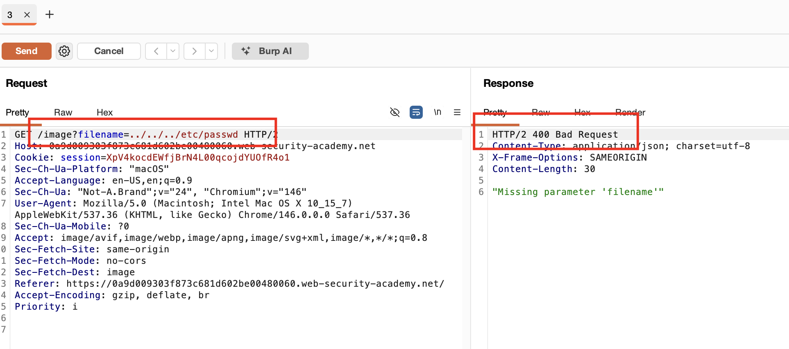
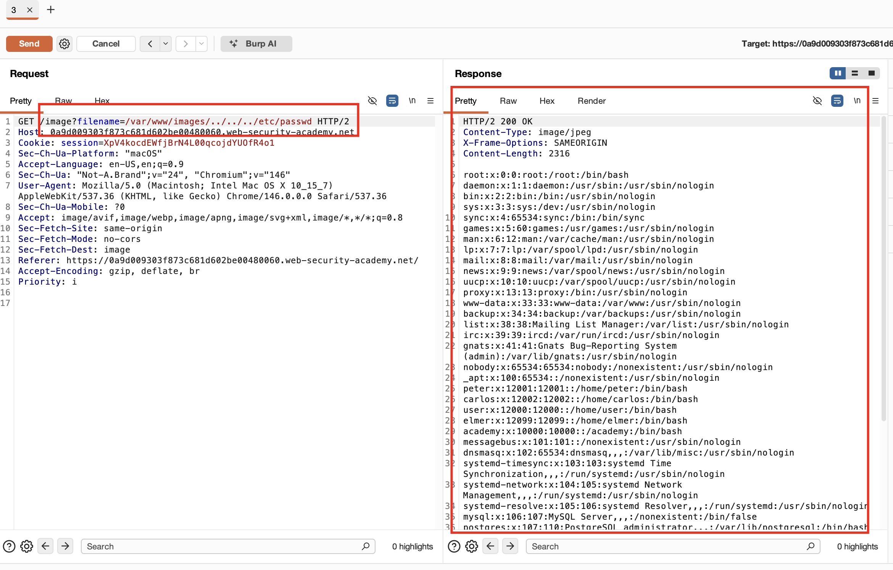

## Mô tả Lab :


## Giải pháp :

Nếu ứng dụng yêu cầu tên file do người dùng cung cấp phải bắt đầu bằng thư mục gốc cụ thể, chẳng hạn /var/www/images, thì có thể **thêm thư mục gốc bắt buộc theo sau là các chuỗi traversal phù hợp.**

Ví dụ:

```bash
filename=/var/www/images/../../../etc/passwd
```

Trong lab này, website tải nhiều ảnh giống như các lab trước, request được bắt trông như sau




Khi chỉ truyền payload `../../../etc/passwd` vào tham số `filename=`, chúng ta nhận được `400 Bad Request`.
Điều này là vì **server yêu cầu filename phải bắt đầu bằng thư mục gốc cụ thể là `/var/www/images`**.



Vì vậy, chúng ta cần gửi payload để lấy file /etc/passwd trong đó payload bắt đầu bằng /var/www/images.

Khi truyền `/var/www/images/../../../etc/passwd` làm payload cho tham số filename, chúng ta có thể lấy được nội dung của file.


